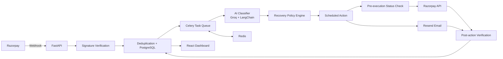

# RecoverAI

> **AI-powered payment recovery orchestration for failed Razorpay payments.**

<p align="left">
  
  
  
  
  
  
  
  
</p>

### Major Tech Stack

**AI / LLM:** LangChain, Groq, structured LLM output  
**Backend:** Python, FastAPI, Pydantic  
**Async Orchestration:** Celery, Redis  
**Data:** PostgreSQL, Psycopg 3  
**Payments & Communication:** Razorpay, Resend  
**Frontend:** React 18, Vite, Recharts  
**DevOps / Tooling:** Docker, uv, Pytest

RecoverAI is an event-driven recovery system that turns failed payment events into **bounded, policy-controlled recovery actions**. Instead of blindly retrying every failure or requiring an operator to manually inspect each case, the system classifies the failure, applies a deterministic recovery policy, schedules the appropriate action, verifies the outcome, and records the result in PostgreSQL.

The design goal is not simply to "send an AI-generated message." It is to build a reliable **recovery workflow around AI** with clear boundaries, asynchronous execution, operational guardrails, and an auditable source of truth.

---

## Problem Statement

Failed payments create immediate revenue leakage, but not every failure should be handled in the same way.

A generic retry strategy has several problems:

- **Different failure modes require different recovery timing.** A temporary bank decline may be recoverable, while a hard decline may not be.
- **Synchronous webhook processing is fragile.** Slow LLM calls, email delivery, or external API calls should not block payment-event ingestion.
- **Repeated actions can become harmful.** A recovery system can spam customers, retry unnecessarily, or continue acting after a payment has already succeeded.
- **AI decisions need deterministic boundaries.** An LLM should not be the final authority over when, how often, or whether the system is allowed to act.
- **Recovery needs observability.** Teams need to know what failed, what the system decided, what action was scheduled, whether it was executed, and whether revenue was actually recovered.

### How RecoverAI Solves It

RecoverAI separates **AI diagnosis** from **deterministic execution policy**:

```text
Razorpay Failure Event
        │
        ▼
Webhook Verification
        │
        ▼
Deduplication + Durable Persistence
        │
        ▼
AI Failure Classification
        │
        ▼
Deterministic Recovery Policy
        │
        ▼
Scheduled Recovery Action
        │
        ▼
Pre-Execution Payment Status Check
        │
   ┌────┴────┐
   │         │
Paid       Still Failed
   │         │
Stop     Execute bounded action
             │
             ▼
        Verify outcome
             │
             ▼
       Persist + Audit
```

The key engineering principle is:

> **AI decides what happened; policy decides what the system is allowed to do.**

---

## Core Capabilities

### 1. Razorpay webhook ingestion

RecoverAI receives failed-payment events through a FastAPI webhook endpoint.

The request path is intentionally lightweight:

1. Verify the webhook signature.
2. Deduplicate the event.
3. Persist the payment/failure record.
4. Schedule downstream processing.
5. Return the webhook response.

LLM inference, email delivery, and other slow operations are handled asynchronously by workers rather than inside the webhook request.

### 2. Structured AI failure classification

The classifier uses **Groq-hosted LLM inference through LangChain** and requests structured JSON output.

Supported failure categories:

| Category | Recovery behavior |
|---|---|
| `insufficient_funds` | One recovery action after **2 minutes** |
| `bank_declined_soft` | Recovery actions after **20 minutes** and **2 hours** |
| `bank_declined_hard` | One recovery action after **5 minutes** |
| `timeout` | Status is rechecked before recovery; action is scheduled after **10 minutes** |
| `user_cancelled` | One recovery action after **3 hours** |
| `other` | No automatic recovery; treated as **manual review** |

The classifier is not responsible for scheduling or executing the final recovery action.

### 3. Deterministic recovery policy

Recovery behavior is enforced by code-level policy controls.

Current safeguards include:

- Maximum **3 messages per payment**
- Quiet hours from **21:00 to 09:00 IST**
- Recovery expiry after **7 days**
- **48-hour attribution window**
- Configurable treatment/holdout split
- Payment-status verification before executing a pending action
- Retry/backoff handling for transient worker failures
- Leases for safe action claiming
- Timeout rechecks with bounded retry count
- Manual-review path for unsupported/unknown failure types

This prevents the LLM from bypassing core business constraints.

### 4. Asynchronous execution with Celery + Redis

Celery workers execute the recovery workflow outside the FastAPI request lifecycle.

Redis acts as the broker/backend infrastructure for task scheduling, while PostgreSQL remains the system of record for payments, actions, outcomes, and operational state.

### 5. Outcome verification

A scheduled action is not considered successful merely because an email/API call completed.

Before executing a recovery action, RecoverAI checks whether the payment has already transitioned to a successful state. After an action is executed, the system records the resulting state so the dashboard and recovery metrics reflect the actual workflow outcome.

### 6. PostgreSQL as the source of truth

The backend stores durable recovery state in PostgreSQL, including payment records, failure classification, recovery actions, execution state, and monitoring information.

The database layer uses **Psycopg 3** and supports configurable schema isolation through `DATABASE_SCHEMA` where configured by the runtime environment.

### 7. Dashboard and operational visibility

A React + Vite frontend surfaces recovery activity and operational metrics from the backend.

The system is designed to make the entire lifecycle visible:

```text
Failure detected
      ↓
Failure classified
      ↓
Treatment / holdout assigned
      ↓
Recovery action scheduled
      ↓
Action claimed / executed
      ↓
Payment status verified
      ↓
Recovered / not recovered / manual review
```

---

## Architecture



### Design Boundaries

**FastAPI** handles ingestion and API access.

**Groq + LangChain** handles failure classification.

**Policy code** owns retry timing, limits, quiet hours, holdouts, expiry, and action eligibility.

**Celery** owns asynchronous execution.

**Redis** provides task-queue infrastructure.

**PostgreSQL** is the durable source of truth.

**Razorpay** is the payment-system integration.

**Resend** is the email delivery provider.

**React/Vite** provides the operational dashboard.

---

## Technology Stack

| Layer | Technology |
|---|---|
| Backend API | FastAPI |
| Language | Python 3.12+ |
| LLM orchestration | LangChain + Groq |
| LLM model | `openai/gpt-oss-120b` by default |
| Background jobs | Celery |
| Queue / broker | Redis |
| Database | PostgreSQL |
| Database driver | Psycopg 3 |
| Payment gateway | Razorpay |
| Email provider | Resend |
| Frontend | React 18 + Vite |
| Charts | Recharts |
| Configuration | Pydantic Settings |
| Testing | Pytest |
| Package management | uv |

---

## Project Structure

```text
RecoverAI/
├── backend/
│   ├── app/
│   │   ├── main.py
│   │   ├── config.py
│   │   ├── db.py
│   │   ├── classifier.py
│   │   ├── policy.py
│   │   ├── razorpay_client.py
│   │   ├── webhook.py
│   │   └── ...
│   ├── tests/
│   │   └── ...
│   └── schema.sql
│
├── backend/worker/
│   ├── celery_app.py
│   └── tasks.py
│
├── frontend/
│   ├── src/
│   ├── package.json
│   └── ...
│
├── docs/
├── logs/
├── pyproject.toml
├── uv.lock
├── apply_migration.py
├── inspect_db.py
└── README.md
```

---

## Local Development

### Prerequisites

Install:

- Python **3.12+**
- `uv`
- Node.js + npm
- PostgreSQL
- Redis

You also need credentials/configuration for Razorpay, Groq, and Resend.

---

## 1. Clone the Repository

```bash
git clone https://github.com/HarshitChaudhary108/RecoverAI.git
cd RecoverAI
```

---

## 2. Configure Backend Environment

RecoverAI loads backend settings from:

```text
backend/.env
```

Create the file and populate the required variables.

### Environment Variables

#### Infrastructure

```env
RAZORPAY_KEY_ID=
RAZORPAY_KEY_SECRET=
RAZORPAY_WEBHOOK_SECRET=

DATABASE_URL=

REDIS_URL=

NGROK_AUTHTOKEN=
```

**What they are for:**

| Variable | Purpose |
|---|---|
| `RAZORPAY_KEY_ID` | Razorpay API credential |
| `RAZORPAY_KEY_SECRET` | Razorpay API credential |
| `RAZORPAY_WEBHOOK_SECRET` | Verifies incoming Razorpay webhook signatures |
| `DATABASE_URL` | PostgreSQL connection string used by the application |
| `TEST_DATABASE_URL` | Optional isolated PostgreSQL connection string for tests |
| `REDIS_URL` | Redis connection used by Celery |
| `NGROK_AUTHTOKEN` | ngrok authentication for local webhook exposure |

#### AI / Email

```env
GROQ_API_KEY=
GROQ_MODEL_NAME=openai/gpt-oss-120b

EMAIL_API_KEY=
EMAIL_FROM=
```

`EMAIL_API_KEY` is the **Resend API key** used for outbound email.

`EMAIL_FROM` is the sender address shown in recovery emails.

### Resend Requirement

For actual email delivery, configure a **valid Resend API key** and a sender identity that Resend allows you to send from.

For production-style use, the recommended setup is:

1. Create a Resend account.
2. Add the domain you control in Resend.
3. Complete the required DNS verification.
4. Generate a Resend API key.
5. Set:

```env
EMAIL_API_KEY=re_xxxxxxxxx
EMAIL_FROM=recovery@yourverifieddomain.com
```

Do **not** assume the development default sender is suitable for production. The sender address should use a **verified domain** owned by you or your organization.

#### LangSmith / Tracing

```env
LANGCHAIN_TRACING_V2=true
LANGCHAIN_ENDPOINT=https://api.smith.langchain.com
LANGCHAIN_API_KEY=
LANGCHAIN_PROJECT=razorpay_failed_payment_recovery_agent
```

`LANGCHAIN_API_KEY` can remain empty when LangSmith tracing is not being used.

---

## 3. Recovery Policy Configuration

The current implementation exposes recovery policy and worker/monitoring controls through application settings.

Important defaults include:

```text
MAX_MESSAGES_PER_PAYMENT=3

QUIET_HOURS_START=21:00
QUIET_HOURS_END=09:00
QUIET_HOURS_TIMEZONE=Asia/Kolkata
QUIET_HOURS_ENABLED=true

RECOVERY_EXPIRY_DAYS=7
RECOVERY_ATTRIBUTION_WINDOW_HOURS=48

HOLDOUT_PERCENT=10
```

Recovery delays currently configured in the application are:

```text
insufficient_funds  -> 2 minutes
bank_declined_soft  -> 20 minutes, 120 minutes
bank_declined_hard  -> 5 minutes
timeout             -> 10-minute status recheck
user_cancelled      -> 180 minutes
other               -> manual review
```

These values are application configuration and can be changed centrally rather than being hard-coded into individual workflow branches.

---

## 4. Install Backend Dependencies

From the repository root:

```bash
uv sync
```

---

## 5. Initialize / Migrate the Database

Use the repository's database schema/migration workflow before starting the application.

The project includes:

```text
backend/schema.sql
apply_migration.py
inspect_db.py
```

For an existing deployment, apply schema changes using the project's migration procedure rather than assuming application code will automatically mutate an already-created PostgreSQL schema.

---

## 6. Start the FastAPI Backend

From the repository root:

```bash
uv run --env-file backend/.env uvicorn backend.app.main:app --host 0.0.0.0 --port 8000
```

Backend:

```text
http://localhost:8000
```

Swagger/OpenAPI:

```text
http://localhost:8000/docs
```

Health endpoint:

```text
GET /health
```

---

## 7. Start the Celery Worker

Open a second terminal:

```bash
uv run --env-file backend/.env celery -A backend.worker.celery_app worker --pool=solo -l info
```

The worker handles asynchronous classification and recovery execution tasks.

---

## 8. Start Celery Beat

Open a third terminal:

```bash
uv run --env-file backend/.env celery -A backend.worker.celery_app beat -l info
```

Beat is responsible for periodic scheduling of recovery/maintenance work.

For local Windows development, the `solo` worker pool is used to avoid common multiprocessing issues.

---

## 9. Start the Frontend

Open another terminal:

```bash
cd frontend
npm install
npm run dev
```

Vite will print the local frontend URL, typically:

```text
http://localhost:5173
```

---

## Webhook Flow

For local Razorpay webhook testing, expose the FastAPI webhook endpoint through ngrok:

```text
Razorpay
   │
   ▼
ngrok HTTPS endpoint
   │
   ▼
POST /webhook/razorpay
   │
   ▼
FastAPI
```

The webhook must be configured in Razorpay to point to the reachable HTTPS URL.

The application validates the webhook signature before accepting the event for processing.

---

## End-to-End Recovery Lifecycle

A typical failed-payment journey looks like this:

```text
1. Razorpay reports payment failure
          ↓
2. RecoverAI verifies the webhook
          ↓
3. Duplicate events are rejected safely
          ↓
4. Payment/failure is persisted in PostgreSQL
          ↓
5. Classification is scheduled asynchronously
          ↓
6. Groq classifies the failure
          ↓
7. Recovery policy selects the allowed action/timing
          ↓
8. Celery schedules the action
          ↓
9. System re-checks payment status
          ↓
10. If already recovered → stop
          ↓
11. If still failed → execute bounded recovery action
          ↓
12. Email is sent through Resend when applicable
          ↓
13. Result is persisted
          ↓
14. Dashboard reflects the updated state
```

---

## Safety and Reliability Controls

RecoverAI is deliberately designed so that AI is **not** the unrestricted execution layer.

### Idempotency and deduplication

Repeated webhook delivery should not create duplicate business actions.

### Pre-action verification

A pending action checks the latest payment state before attempting recovery. This prevents unnecessary action after a payment has already succeeded.

### Bounded customer contact

The system enforces a maximum number of messages per payment and does not send during configured quiet hours.

### Expiry

Recovery opportunities expire after the configured recovery window.

### Retry and leases

Background tasks use bounded retries, backoff, and action-claiming/lease mechanics to reduce duplicate execution and stuck work.

### Holdout support

A configurable holdout percentage allows a subset of eligible failures to remain untreated so the system can compare recovery outcomes rather than measuring only treated cases.

### Manual review

Unknown or unsupported failures are not forced through an automatic recovery path.

---

## Observability

RecoverAI includes application logging, persistent operational state, and health monitoring designed around the recovery lifecycle.

The backend tracks states such as:

```text
failed
classified
scheduled
pending
executing
sent
recovered
expired
manual_review
```

The project also includes monitoring thresholds for:

- rolling health windows
- minimum attempt volume
- recovery-success floors
- baseline comparisons
- healthy-streak clearing
- stuck classification detection

This allows the recovery system to be monitored as an operational service rather than treated as a black-box AI feature.

---

## Testing

The backend uses Pytest.

Run:

```bash
uv run pytest
```

Or specifically:

```bash
uv run pytest backend/tests -v
```

The test suite covers important hardening scenarios around:

- webhook behavior
- persistence/transactions
- policy enforcement
- alert hysteresis
- recovery metrics
- action execution
- failure handling

A successful test run should be treated as a prerequisite before deploying configuration or schema changes to a shared environment.

---

## Database Inspection

For debugging local or development state, the repository includes:

```bash
uv run --env-file backend/.env python inspect_db.py
```

This is useful for verifying:

- received payment events
- failure classification
- recovery actions
- action status
- timestamps
- recovery outcomes

PostgreSQL remains the source of truth; the dashboard is a presentation layer over that state.

---

## API Surface

The application exposes a FastAPI API including the payment webhook and operational endpoints.

The most important integration endpoint is:

```http
POST /webhook/razorpay
```

Swagger provides the complete generated API specification:

```text
http://localhost:8000/docs
```

---

## Production Considerations

RecoverAI is structured as a production-oriented prototype, but a real production deployment still requires infrastructure hardening appropriate to the target environment.

Recommended production controls include:

- Managed PostgreSQL with backups and connection monitoring
- Managed Redis with TLS and connection limits
- Proper secret management instead of checked-in environment files
- HTTPS termination in front of the API
- Secure Razorpay webhook configuration
- Verified Resend sending domain
- Restricted CORS configuration
- Centralized logs and alerting
- Worker concurrency/capacity planning
- Database migration management
- API rate limiting where appropriate
- Deployment health checks and rollback strategy

---

## Security Notes

Never commit:

```text
backend/.env
.env
API keys
database passwords
Razorpay secrets
webhook secrets
Resend API keys
Groq API keys
LangSmith credentials
```

Use environment variables or a managed secrets system for credentials.

---

## Why This Is More Than an AI Classifier

RecoverAI is intentionally built as a **system**, not a prompt demo.

The LLM solves a narrow problem:

> **What type of payment failure occurred?**

The rest of the workflow is deterministic and operational:

> **What should happen, when should it happen, is the action still allowed, was it executed, and did it actually lead to recovery?**

That separation makes the system easier to reason about, test, observe, and extend.

---

## Engineering Highlights

From an AI engineering perspective, the project demonstrates:

- Event-driven architecture
- Asynchronous AI workflows
- Structured LLM output
- Deterministic policy enforcement around AI
- Background task orchestration with Celery
- Redis-backed scheduling
- PostgreSQL-backed durable state
- External API integration with Razorpay
- Transactional email delivery through Resend
- Idempotency and deduplication
- Retry/backoff and lease-based execution
- Treatment/holdout experimentation
- Operational health monitoring
- Automated backend testing
- React-based operational dashboard

---

## Current Scope

RecoverAI currently focuses on **failed Razorpay payment recovery**.

The architecture is intentionally extensible so the same recovery pattern can later support other revenue-loss events such as subscription-payment failures, recurring-payment retries, or additional payment providers.

The current implementation should be evaluated as an **AI-powered revenue recovery engineering project / production-oriented prototype**, not as a claim of unrestricted autonomous payment operations.

---

## Author

**Harshit Chaudhary**

AI Engineer / Agentic AI Engineer

GitHub: https://github.com/HarshitChaudhary108  
LinkedIn: https://www.linkedin.com/in/harshit-chaudhary-ai/
